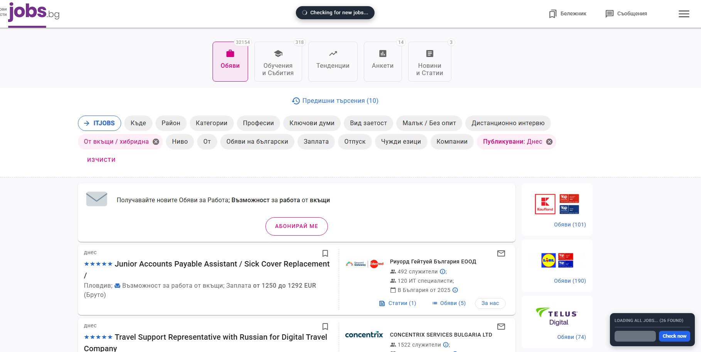

# Show Not Viewed Jobs

A Tampermonkey userscript that highlights job postings you haven't seen yet on
[jobs.bg](https://www.jobs.bg) job listing pages, so you don't have to manually
re-scan the whole list every time you check for new openings.

> **This script only works on jobs.bg.** It's built around that site's actual
> markup and its internal pagination mechanism (see "The interesting parts"
> below), not a generic infinite-scroll pattern. It won't work on other job
> sites without changes — see the note at the end of "The interesting parts".

## Screenshots

**Checking for new jobs** — a non-blocking toast and progress badge, instead
of a page-freezing `alert()`:

**A new job found** — highlighted directly in the list, with the badge
showing how many:

**Nothing new since last check:**

## Why I built this

I check jobs.bg regularly, and manually comparing "what's new since last time
I looked" got tedious fast. This script keeps track of which job postings
you've already seen (using `localStorage`) and highlights only the ones that
are new since your last check.

## What it does

- Highlights new/unseen job postings in green directly on the page.
- Lets you click the job counter to jump to each new job, one at a time.
- Runs fully on demand — nothing scans automatically, you control it with a
  "Check now" button.
- Handles infinite-scroll listings by auto-scrolling to load everything before
  scanning.

## The interesting parts

A few things made this non-trivial:

1. **jobs.bg doesn't load more jobs on a normal scroll event** — I initially
   assumed it was standard infinite scroll and simulated scrolling to the
   bottom of the page, which turned out to be unreliable: it worked
   inconsistently and often just got stuck. Digging into the page's own
   scripts, jobs.bg loads additional pages through an internal object it
   exposes as `window.pageDataList` (an instance of the site's own
   `Scrollable` helper class), and the method that actually fetches and
   appends the next batch is `pageDataList.scrollShowPage()`. The script
   calls that directly instead of simulating scroll — verified against the
   live site to reliably load the full list. If that internal object isn't
   present (e.g. the site changes its implementation), the script falls back
   to simulated scrolling so it degrades instead of breaking outright.
2. **Identifying the same job across separate runs**, even though the DOM
   order or structure can shift between page loads. The script uses a fallback
   chain: it tries the job's link URL first, then a data attribute, then the
   title text, so it degrades gracefully instead of breaking if one of those
   isn't available.
3. **jobs.bg only keeps a small window of job listings in the DOM at a time**
   (it discards earlier pages as more load, to stay fast with tens of
   thousands of listings). Loading everything first and comparing only at the
   end doesn't work here, since an earlier "new" job can already be gone from
   the DOM by the time you check. The script instead scans and highlights
   after every page loads, while items are still present, instead of waiting
   until loading is fully done.

**Porting this to another site:** because of point 1, this script isn't a
drop-in generic infinite-scroll highlighter — it depends on jobs.bg's specific
markup (`CONFIG.JOB_SELECTORS`, tuned to jobs.bg's `page-N` list containers)
and its specific internal loading mechanism (`triggerNextPage()` in the
script). Using it on a different site would mean re-inspecting that site's
markup and pagination mechanism and updating both of those accordingly.

## Files in this repo

- **`showNotViewedJobs.user.js`** — the full userscript, with the Tampermonkey
  metadata header (`// ==UserScript==` block) at the top. Use this one for
  Tampermonkey.
- **`showNotViewedJobs.js`** — the exact same script, minus that header block.
  Use this one if you're pasting into the DevTools Console or saving as a
  DevTools Snippet, so there's nothing to strip out first.

Both files contain the same logic. **If you change the script, update both**
— there's nothing that keeps them in sync automatically.

## Installation

There are a few ways to run this.

### Option 1: Tampermonkey (recommended)

1. Install the [Tampermonkey](https://www.tampermonkey.net/) browser extension.
2. Open Tampermonkey's dashboard and create a new script.
3. Paste the contents of `showNotViewedJobs.user.js` into it.
4. Save. The script is pre-configured to run on jobs.bg job search pages.
5. Visit a jobs.bg job listing page — the control panel appears automatically,
   every time, with no extra step.

This is the lowest-friction option long-term: once installed, it's just there
on every visit.

### Option 2: paste into the DevTools Console

1. Open a jobs.bg job listing page.
2. Open DevTools (F12, or Ctrl+Shift+I / Cmd+Option+I) and go to the
   **Console** tab.
3. Copy the contents of `showNotViewedJobs.js` and paste it into the console,
   then press Enter.
4. The control panel appears in the bottom-right corner.

No extension needed, but you have to repeat this every time you reload the
page or open it in a new tab — the console doesn't remember pasted code.

### Option 3: save as a Chrome DevTools Snippet

A middle ground between the two above — no extension, but you don't have to
re-paste the whole script every time.

1. Open DevTools → **Sources** tab → **Snippets** (in the left sidebar).
2. Click "+ New snippet", name it something like `showNotViewedJobs`.
3. Paste the contents of `showNotViewedJobs.js` in and save (Ctrl+S / Cmd+S).
4. On any jobs.bg listing page, open the Snippets panel again, find it, and
   run it (right-click → Run, or Ctrl+Enter / Cmd+Enter while it's open).

The snippet is saved in that Chrome installation's DevTools storage, so it
persists across restarts, but it's local to that one browser/profile (it
won't follow you to a different computer or browser) and you still have to
manually run it each time you want the panel on a fresh page load.

## Configuration

The selectors used to find job postings on the page are defined in the
`CONFIG.JOB_SELECTORS` array near the top of the script, tuned to jobs.bg's
markup. If jobs.bg changes its markup, update the selectors there.

## License

MIT
